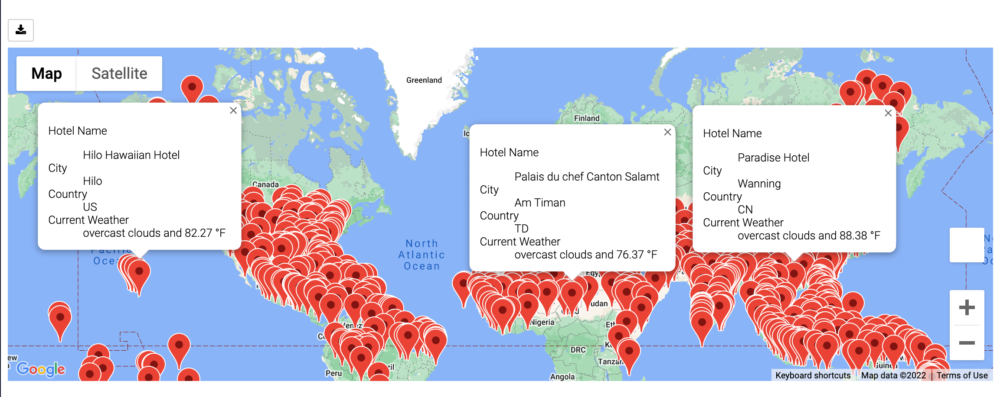
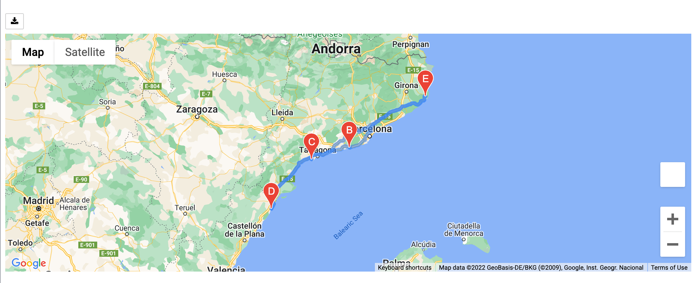
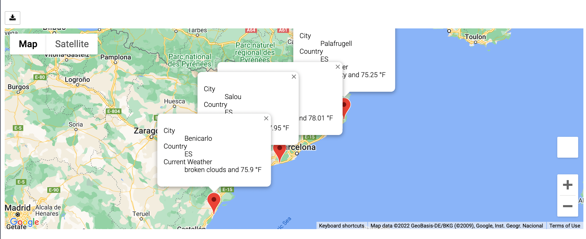

# World_Weather_Analysis
## Purpose and Overview
### Purpose
The purpose of this challenge was to learn how to make API requests to retrieve information and create maps with multiple layers and markers using gmaps. 
### Overview
Using numpy I generated over 2000 pairs of coordinates, which I then matched to their nearest cities using citipy. This resulted in approximately 1,600 cities. Weather information was gathered from openweathermap.org utilizing the Weather API key that was generated from the site. Next, I filtered the cities to match certain maximum and minimum temperatures. From this preferred list of cities I created a new dataframe, created a map using gmaps for this preferred list of cities, and chose four cities for the next portion of the challenge. An image of the map created from the preferred cities dataframe was saved as WeatherPy_vacation_map.png
 

Using gmaps I was able to create a map with dirivng directions. An image of this map was titled WeatherPy_travel_map.png. 
 

I then created another map without the directions, and only with map markers. An image of this final map was saved as WeatherPy_travel_map_markers.png
 
